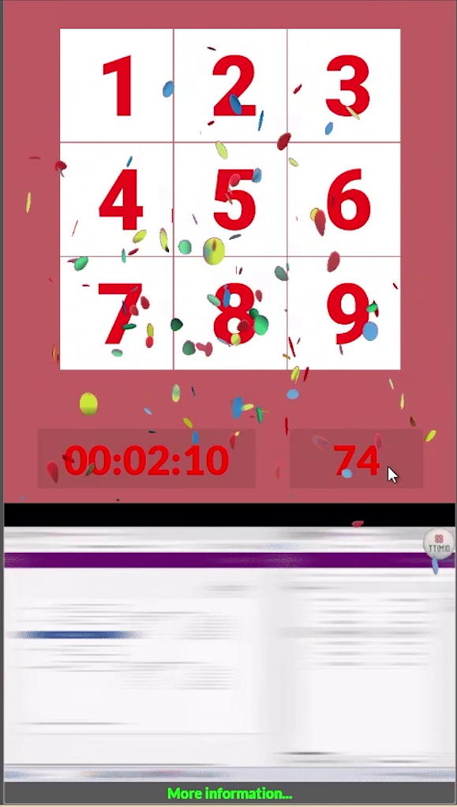

# The Sliding Picture Game written in Microsoft Power apps: Installation and Setup

This is a short (~3.5 minute) install and setup walkthrough for a Sliding Picture Puzzle game built in Microsoft PowerApps. The presenter covers what's included in the download (the .msapp file and a zip of image assets), explains that the image assets must be hosted somewhere accessible via URL (they use OneDrive), and shows how to grab the base URL path needed for configuration. They then demo the game itself — a classic 8-puzzle (3×3 grid with one blank tile) where players slide numbered or image-based tiles into order. The game features a live timer, swap counter, a confetti animation on completion, and an optional "More Information" button linking to an external URL. The video closes with a call to action to explore the creator's other PowerApps work and to like/share/subscribe.

YouTube Video: https://youtu.be/XDOuvzWEV_k 
